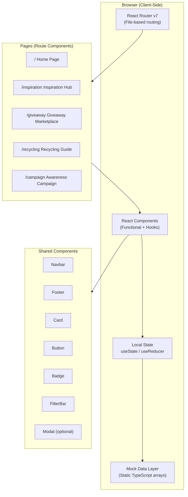
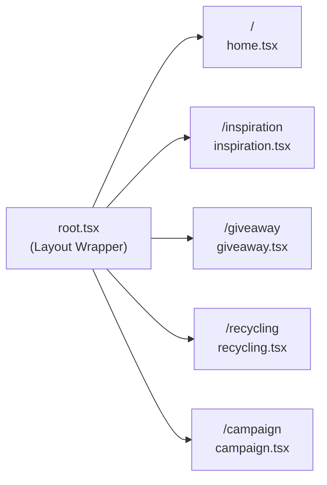
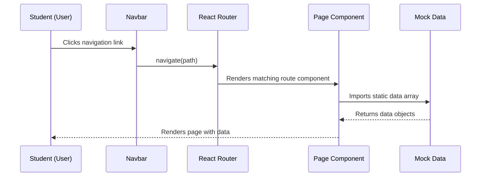
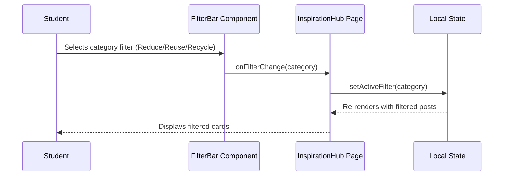
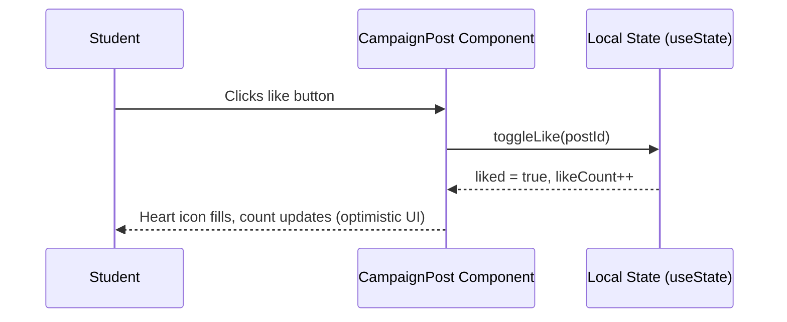
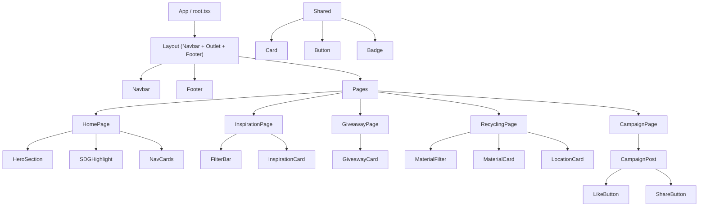

# Design Document: ReLoop – 3R Campus Platform

## Overview

ReLoop is a responsive React.js web application that empowers university students to embrace the 3R principles — Reduce, Reuse, and Recycle — through five interconnected modules: a mission-driven Home page, a Waste Reduction Inspiration Hub, a Giveaway Marketplace, a Recycling Guide with Drop-Off Locator, and an Instagram-style Awareness Campaign Feed. The platform is frontend-only (no backend), uses React Router v7 for navigation, Tailwind CSS v4 for styling, and relies on mock data and local React state to simulate all dynamic interactions.

The application aligns with UN SDG 12.5 (Responsible Consumption and Production) and targets university students with an eco-friendly, modern, and student-friendly interface built around the brand color palette: Primary Light `#DDEB9D`, Primary Green `#A0C878`, Deep Blue `#27667B`, and Dark Blue `#143D60`.

The existing codebase is a React Router v7 + Vite + Tailwind CSS v4 + TypeScript SSR project. The implementation will integrate seamlessly into this scaffold, replacing the default welcome content with the full ReLoop application.

---

## Architecture

### High-Level System Architecture



### Route Structure



---

## Sequence Diagrams

### User Navigation Flow



### Inspiration Hub Filter Flow



### Campaign Page Like Flow



---

## Components and Interfaces

### Component Hierarchy



### Shared: `<Navbar />`

**Purpose**: Site-wide navigation bar with logo, links, and mobile hamburger menu.

**Interface**:
```typescript
interface NavbarProps {
  // No props — reads active route from useLocation()
}

interface NavLink {
  label: string;
  path: string;
  icon?: string; // emoji or icon class
}
```

**Responsibilities**:
- Render logo ("ReLoop ♻️") and brand name
- Render navigation links to all 5 pages
- Highlight active route using `useLocation()`
- Collapse into hamburger menu on mobile (`< 768px`)
- Toggle mobile menu open/close via `useState`

---

### Shared: `<Footer />`

**Purpose**: Page footer with SDG branding, quick links, and copyright.

**Interface**:
```typescript
interface FooterProps {
  // No props — static content
}
```

**Responsibilities**:
- Display SDG 12.5 badge and tagline
- Render quick links to all pages
- Show copyright notice
- Responsive grid layout (1 col mobile / 3 col desktop)

---

### Shared: `<Card />`

**Purpose**: Generic reusable card container with consistent shadow, border-radius, and hover effect.

**Interface**:
```typescript
interface CardProps {
  children: React.ReactNode;
  className?: string;
  onClick?: () => void;
  hoverable?: boolean; // enables hover lift animation
}
```

**Responsibilities**:
- Render children inside styled card container
- Apply `hoverable` prop for `transform hover:-translate-y-1` transition
- Forward `onClick` handler for interactive cards

---

### Shared: `<Button />`

**Purpose**: Reusable button with theme variants.

**Interface**:
```typescript
type ButtonVariant = "primary" | "secondary" | "outline" | "ghost";
type ButtonSize = "sm" | "md" | "lg";

interface ButtonProps {
  children: React.ReactNode;
  variant?: ButtonVariant;        // default: "primary"
  size?: ButtonSize;              // default: "md"
  onClick?: () => void;
  disabled?: boolean;
  fullWidth?: boolean;
  type?: "button" | "submit";
  className?: string;
}
```

**Responsibilities**:
- Apply variant-specific Tailwind classes using a variant map
- Support full-width mode
- Visually disable when `disabled` is true

---

### Shared: `<Badge />`

**Purpose**: Category label chip for Reduce / Reuse / Recycle and condition tags.

**Interface**:
```typescript
type BadgeColor = "reduce" | "reuse" | "recycle" | "good" | "fair" | "new";

interface BadgeProps {
  label: string;
  color: BadgeColor;
}
```

**Responsibilities**:
- Map `color` value to specific Tailwind background/text class combo
- Render small pill/chip element

---

### Page: `<HomePage />`

**Purpose**: Landing page introducing ReLoop's mission and SDG 12.5 alignment.

**Interface**:
```typescript
interface HeroSectionProps {
  // Static content, no props
}

interface NavCardData {
  title: string;
  description: string;
  icon: string;
  path: string;
  color: string; // Tailwind gradient classes
}
```

**Responsibilities**:
- Render full-width hero with tagline and CTA buttons
- Display SDG 12.5 highlight section with statistics
- Render `NavCard` grid linking to the 4 main modules
- Animate hero text on mount using CSS transitions

---

### Page: `<InspirationHubPage />`

**Purpose**: Browse and filter 3R inspiration posts by category.

**Interface**:
```typescript
interface InspirationPost {
  id: string;
  title: string;
  description: string;
  category: "Reduce" | "Reuse" | "Recycle";
  author: string;
  imageEmoji: string; // emoji placeholder for image
  tags: string[];
  createdAt: string;
}

interface InspirationCardProps {
  post: InspirationPost;
}

interface FilterBarProps {
  categories: string[];
  activeFilter: string;
  onFilterChange: (category: string) => void;
}
```

**Responsibilities**:
- Manage `activeFilter` state (default: "All")
- Derive `filteredPosts` from `activeFilter` and mock data
- Render `FilterBar` and grid of `InspirationCard` components
- Each card shows emoji, title, description, category badge, author, tags

---

### Page: `<GiveawayMarketplacePage />`

**Purpose**: Browse items students are giving away.

**Interface**:
```typescript
interface GiveawayItem {
  id: string;
  itemName: string;
  description: string;
  condition: "New" | "Good" | "Fair";
  category: string;
  donorName: string;
  postedAt: string;
  emoji: string;
  isAvailable: boolean;
}

interface GiveawayCardProps {
  item: GiveawayItem;
  onRequestItem: (id: string) => void;
}
```

**Responsibilities**:
- Display grid of `GiveawayCard` components from mock data
- "Request Item" button triggers `onRequestItem` (sets local UI state to "Requested")
- Filter bar for category filtering
- Show availability badge (Available / Requested)

---

### Page: `<RecyclingGuidePage />`

**Purpose**: Reference guide for recyclable materials and campus drop-off locations.

**Interface**:
```typescript
interface RecyclableMaterial {
  id: string;
  name: string;
  type: "Plastic" | "Paper" | "Glass" | "Metal" | "Electronics" | "Organic";
  description: string;
  tips: string[];
  emoji: string;
}

interface DropOffLocation {
  id: string;
  name: string;
  building: string;
  acceptedMaterials: string[];
  hours: string;
  emoji: string;
}

interface MaterialFilterProps {
  types: string[];
  activeType: string;
  onTypeChange: (type: string) => void;
}
```

**Responsibilities**:
- Manage `activeType` filter state (default: "All")
- Render filtered material cards in a grid
- Render drop-off location list below
- Cross-filter: clicking a location material tag updates the material filter
- Map placeholder: render a styled `<div>` with campus map description

---

### Page: `<AwarenessCampaignPage />`

**Purpose**: Instagram-style feed of SDG 12.5 awareness posts with like/share UI.

**Interface**:
```typescript
interface CampaignPost {
  id: string;
  author: string;
  avatar: string; // emoji avatar
  content: string;
  imageEmoji: string; // large emoji representing image
  hashtags: string[];
  likes: number;
  shares: number;
  postedAt: string;
}

interface CampaignPostProps {
  post: CampaignPost;
  liked: boolean;
  likeCount: number;
  onLike: (id: string) => void;
  onShare: (id: string) => void;
}

interface LikeState {
  [postId: string]: { liked: boolean; count: number };
}
```

**Responsibilities**:
- Manage `likeState` map in parent component using `useState<LikeState>`
- Render posts in a 1–3 column Instagram-style masonry-like grid
- Animate like button with scale transform on click
- Share button copies hashtags to clipboard (navigator.clipboard API)

---

## Data Models

### Mock Data: `inspirationPosts: InspirationPost[]`

```typescript
const inspirationPosts: InspirationPost[] = [
  {
    id: "ip-001",
    title: "Turn Glass Jars into Plant Pots",
    description: "Repurpose empty glass jars as small planters for herbs on your dorm windowsill.",
    category: "Reuse",
    author: "Aisha Rahman",
    imageEmoji: "🪴",
    tags: ["DIY", "Plants", "Dorm Life"],
    createdAt: "2024-11-15"
  },
  // ... 9 more posts covering all 3 categories
]
```

### Mock Data: `giveawayItems: GiveawayItem[]`

```typescript
const giveawayItems: GiveawayItem[] = [
  {
    id: "gw-001",
    itemName: "Engineering Textbooks (Year 1)",
    description: "Set of 4 first-year engineering textbooks, lightly used.",
    condition: "Good",
    category: "Books",
    donorName: "Wei Xiang",
    postedAt: "2024-11-20",
    emoji: "📚",
    isAvailable: true
  },
  // ... 7 more items across Books, Electronics, Stationery, Furniture categories
]
```

### Mock Data: `recyclableMaterials: RecyclableMaterial[]`

```typescript
const recyclableMaterials: RecyclableMaterial[] = [
  {
    id: "rm-001",
    name: "PET Plastic Bottles",
    type: "Plastic",
    description: "Clear plastic water and beverage bottles.",
    tips: ["Rinse before recycling", "Remove caps and labels", "Flatten to save space"],
    emoji: "🍶"
  },
  // ... 11 more materials across all 6 types
]
```

### Mock Data: `dropOffLocations: DropOffLocation[]`

```typescript
const dropOffLocations: DropOffLocation[] = [
  {
    id: "loc-001",
    name: "Main Library Recycling Station",
    building: "Central Library, Ground Floor",
    acceptedMaterials: ["Paper", "Plastic", "Metal"],
    hours: "Mon–Fri: 8am–8pm",
    emoji: "📚"
  },
  // ... 4 more campus locations
]
```

### Mock Data: `campaignPosts: CampaignPost[]`

```typescript
const campaignPosts: CampaignPost[] = [
  {
    id: "cp-001",
    author: "ReLoop Official",
    avatar: "♻️",
    content: "Did you know that recycling one aluminum can saves enough energy to run a TV for 3 hours? Start small, think big! 🌍",
    imageEmoji: "🥫",
    hashtags: ["#ReLoop", "#RecycleRight", "#SDG12", "#ZeroWaste"],
    likes: 142,
    shares: 38,
    postedAt: "2024-11-18"
  },
  // ... 5 more posts from students and organizations
]
```

---

## Low-Level Design

### Algorithmic Pseudocode

#### Algorithm: Filtering Inspiration Posts

```pascal
FUNCTION filterPosts(posts, activeFilter)
  INPUT:  posts: InspirationPost[], activeFilter: string
  OUTPUT: filteredPosts: InspirationPost[]

  BEGIN
    IF activeFilter = "All" THEN
      RETURN posts
    END IF

    filteredPosts ← []

    FOR EACH post IN posts DO
      IF post.category = activeFilter THEN
        filteredPosts.append(post)
      END IF
    END FOR

    RETURN filteredPosts
  END
END FUNCTION
```

**Preconditions:**
- `posts` is a non-null array (may be empty)
- `activeFilter` is one of `"All"`, `"Reduce"`, `"Reuse"`, `"Recycle"`

**Postconditions:**
- Returns a subset of `posts` where `category === activeFilter`, or full array if `"All"`
- Original `posts` array is not mutated

---

#### Algorithm: Toggle Like on Campaign Post

```pascal
FUNCTION toggleLike(likeState, postId)
  INPUT:  likeState: LikeState, postId: string
  OUTPUT: newLikeState: LikeState

  BEGIN
    current ← likeState[postId]

    IF current.liked = true THEN
      newLikeState ← { ...likeState, [postId]: { liked: false, count: current.count - 1 } }
    ELSE
      newLikeState ← { ...likeState, [postId]: { liked: true, count: current.count + 1 } }
    END IF

    RETURN newLikeState
  END
END FUNCTION
```

**Preconditions:**
- `likeState[postId]` exists and has been initialized from mock data
- `count >= 0` always

**Postconditions:**
- Returns new state object (immutable update — does not mutate original)
- `liked` toggles between true/false
- `count` increments by 1 on like, decrements by 1 on unlike
- `count` never goes below 0

---

#### Algorithm: Initialize Like State from Posts

```pascal
FUNCTION initLikeState(posts)
  INPUT:  posts: CampaignPost[]
  OUTPUT: likeState: LikeState

  BEGIN
    likeState ← {}

    FOR EACH post IN posts DO
      likeState[post.id] ← { liked: false, count: post.likes }
    END FOR

    RETURN likeState
  END
END FUNCTION
```

**Preconditions:**
- `posts` is a non-null array
- Each `post.id` is unique

**Postconditions:**
- Returns a map keyed by post id
- All entries initialized with `liked: false` and `count` from mock data

---

#### Algorithm: Mobile Menu Toggle

```pascal
PROCEDURE toggleMobileMenu(isOpen, setIsOpen)
  INPUT:  isOpen: boolean, setIsOpen: React.Dispatch<boolean>
  OUTPUT: side-effect (state update)

  BEGIN
    setIsOpen(NOT isOpen)
  END
END PROCEDURE
```

**Preconditions:**
- `setIsOpen` is a valid React state setter

**Postconditions:**
- `isOpen` will be flipped in next render cycle
- Menu renders open/closed based on `isOpen` value

---

### Key Functions with Formal Specifications

#### `Navbar` Component

```typescript
function Navbar(): JSX.Element
```

**Preconditions:**
- Must be rendered inside a `<BrowserRouter>` / React Router context (provides `useLocation`)
- `NAV_LINKS` constant is defined

**Postconditions:**
- Renders a `<nav>` element with all navigation links
- Active link is visually highlighted (darker background, underline)
- On screens `< 768px`, desktop links are hidden; hamburger icon is shown
- Mobile menu slides in when `isMenuOpen === true`

**Internal State:**
```typescript
const [isMenuOpen, setIsMenuOpen] = useState<boolean>(false);
const location = useLocation();
// isActive = (path: string) => location.pathname === path
```

---

#### `InspirationHubPage` Component

```typescript
function InspirationHubPage(): JSX.Element
```

**Preconditions:**
- `inspirationPosts` mock data array is imported and non-empty

**Postconditions:**
- All posts are visible when `activeFilter === "All"`
- Only matching posts are visible when a category filter is selected
- Filter state persists for the component's lifetime (resets on unmount/navigate away)

**Internal State:**
```typescript
const [activeFilter, setActiveFilter] = useState<string>("All");
const filteredPosts = activeFilter === "All"
  ? inspirationPosts
  : inspirationPosts.filter(p => p.category === activeFilter);
```

---

#### `GiveawayMarketplacePage` Component

```typescript
function GiveawayMarketplacePage(): JSX.Element
```

**Preconditions:**
- `giveawayItems` mock data array is imported

**Postconditions:**
- Items render with correct condition badge color (New → green, Good → teal, Fair → yellow)
- "Request Item" button changes to "Requested ✓" after click and becomes disabled
- Requested item IDs are tracked in local state set

**Internal State:**
```typescript
const [requestedIds, setRequestedIds] = useState<Set<string>>(new Set());
const [activeCategory, setActiveCategory] = useState<string>("All");
// handleRequest = (id: string) => setRequestedIds(prev => new Set([...prev, id]))
```

---

#### `RecyclingGuidePage` Component

```typescript
function RecyclingGuidePage(): JSX.Element
```

**Preconditions:**
- `recyclableMaterials` and `dropOffLocations` mock data are imported

**Postconditions:**
- Material cards filter correctly based on `activeType`
- Location cards always display full list (unfiltered)
- Map placeholder renders a styled div with campus location description

**Internal State:**
```typescript
const [activeType, setActiveType] = useState<string>("All");
const filteredMaterials = activeType === "All"
  ? recyclableMaterials
  : recyclableMaterials.filter(m => m.type === activeType);
```

---

#### `AwarenessCampaignPage` Component

```typescript
function AwarenessCampaignPage(): JSX.Element
```

**Preconditions:**
- `campaignPosts` mock data is imported
- `initLikeState(campaignPosts)` produces valid initial state

**Postconditions:**
- Each post's like count reflects current `likeState[post.id].count`
- Liked posts show filled heart `❤️`; unliked show outline `🤍`
- Share button triggers `navigator.clipboard.writeText(hashtags.join(" "))`
- Like state persists within the page session

**Internal State:**
```typescript
const [likeState, setLikeState] = useState<LikeState>(() => initLikeState(campaignPosts));
// handleLike = (id: string) => setLikeState(prev => toggleLike(prev, id))
```

---

### File & Directory Structure

```
app/
├── app.css                          # Global styles + Tailwind v4 imports + CSS variables
├── root.tsx                         # Root layout — wraps Layout with Navbar + Footer
├── routes.ts                        # React Router v7 route config
│
├── routes/
│   ├── home.tsx                     # Route: / (Home Page)
│   ├── inspiration.tsx              # Route: /inspiration
│   ├── giveaway.tsx                 # Route: /giveaway
│   ├── recycling.tsx                # Route: /recycling
│   └── campaign.tsx                 # Route: /campaign
│
├── components/
│   ├── Navbar.tsx
│   ├── Footer.tsx
│   ├── Card.tsx
│   ├── Button.tsx
│   └── Badge.tsx
│
├── data/
│   ├── inspirationData.ts           # inspirationPosts mock array
│   ├── giveawayData.ts              # giveawayItems mock array
│   ├── recyclingData.ts             # recyclableMaterials + dropOffLocations
│   └── campaignData.ts              # campaignPosts mock array
│
└── types/
    └── index.ts                     # All shared TypeScript interfaces
```

---

## Correctness Properties

*A property is a characteristic or behavior that should hold true across all valid executions of a system — essentially, a formal statement about what the system should do. Properties serve as the bridge between human-readable specifications and machine-verifiable correctness guarantees.*

### Property 1: Filter Completeness

*For any* non-empty array of `InspirationPost` items, calling `filterPosts` with `activeFilter === "All"` SHALL return every item in the original array with no omissions.

**Validates: Requirements 3.1, 9.1**

---

### Property 2: Filter Correctness

*For any* array of `InspirationPost` items and any specific category value (`"Reduce"`, `"Reuse"`, `"Recycle"`), every item in the result of `filterPosts` SHALL have its `category` field equal to the supplied filter value.

**Validates: Requirements 3.2, 9.2**

---

### Property 3: Like Toggle Idempotency (Round-Trip)

*For any* `LikeState` and any `postId`, calling `toggleLike` twice in succession SHALL return a `LikeState` where `likeState[postId].count` equals its value before either call.

**Validates: Requirements 10.2**

---

### Property 4: Like Count Non-Negativity

*For any* `LikeState` and any sequence of `toggleLike` operations, `likeState[postId].count` SHALL remain greater than or equal to 0 at all times.

**Validates: Requirements 6.5, 10.6**

---

### Property 5: Request State Exclusivity

*For any* `GiveawayItem` whose ID is present in `requestedIds`, the corresponding "Request Item" button SHALL be disabled and display the label "Requested ✓", and SHALL NOT be interactive.

**Validates: Requirements 4.2, 4.3**

---

### Property 6: Navigation Correctness

*For any* route path in `{ "/", "/inspiration", "/giveaway", "/recycling", "/campaign" }`, clicking the corresponding `NavLink` SHALL cause React Router to render the correct page component for that route.

**Validates: Requirements 1.2**

---

### Property 7: Active Route Highlight Exclusivity

*For any* valid pathname, exactly one Navbar link — the one whose `path` equals `location.pathname` — SHALL have the active style applied, and all other Navbar links SHALL not have the active style.

**Validates: Requirements 1.3**

---

### Property 8: Material Filter Completeness

*For any* non-empty array of `RecyclableMaterial` items, when `activeType === "All"`, all items in the array SHALL be rendered by the RecyclingGuide.

**Validates: Requirements 5.1**

---

### Property 9: Like State Initialization

*For any* array of `CampaignPost` items passed to `initLikeState`, the returned `LikeState` SHALL contain an entry for every `post.id` in the input array where `liked === false` and `count === post.likes`.

**Validates: Requirements 6.1, 10.3, 10.4**

---

### Property 10: Filter Purity (No Mutation)

*For any* input array of `InspirationPost` items, calling `filterPosts` with any valid filter value SHALL NOT mutate the original input array — the original array SHALL remain identical before and after the call.

**Validates: Requirements 9.3**

---

## Error Handling

### Scenario 1: Empty Filter Results

**Condition**: User selects a category filter and no mock data items match.
**Response**: Render an empty-state UI — a centered message with emoji (e.g., "🌱 No posts yet in this category") and a "Clear Filter" button.
**Recovery**: User clicks "Clear Filter" → `setActiveFilter("All")` → all items visible again.

---

### Scenario 2: Clipboard API Unavailable (Share Button)

**Condition**: `navigator.clipboard` is undefined (HTTP context or unsupported browser).
**Response**: Gracefully fall back — show a tooltip or alert with the hashtag text to copy manually.
**Recovery**: User reads hashtags from alert/tooltip and copies manually.

---

### Scenario 3: Route Not Found

**Condition**: User navigates to an undefined path (e.g., `/unknown`).
**Response**: React Router's existing `ErrorBoundary` in `root.tsx` handles 404 with a styled error page.
**Recovery**: User clicks "Back to Home" button rendered in the 404 page.

---

## Testing Strategy

### Unit Testing Approach

Test pure utility functions in isolation:
- `filterPosts(posts, filter)` — test with all 4 filter values
- `toggleLike(likeState, postId)` — test toggle on/off and count bounds
- `initLikeState(posts)` — verify all post IDs are keyed with correct initial counts

### Property-Based Testing Approach

**Property Test Library**: `fast-check`

Key properties to test:
- `filterPosts` is idempotent for same input
- `toggleLike` applied twice returns original state
- `initLikeState(posts).count` === `posts[i].likes` for all i
- Filtered array length ≤ original array length for any filter

### Integration Testing Approach

- Render each page with mock data and verify cards render correctly
- Test Navbar active state updates when `location.pathname` changes
- Test filter bar updates trigger correct re-render of card grid

---

## Performance Considerations

- All mock data is static — no network requests, so TTI (Time to Interactive) is minimal
- `useMemo` should be applied to filtered data derivations in list-heavy pages (InspirationHub, RecyclingGuide) to avoid unnecessary recomputation on unrelated state changes
- Images are replaced with emoji to avoid large asset loads — keeps the bundle small
- Tailwind v4's JIT compiler ensures only used utility classes are included in the final CSS bundle
- React Router v7 with SSR enabled means initial HTML is server-rendered, improving perceived load time

---

## Security Considerations

- No user authentication, payment, or personal data collection — attack surface is minimal
- The share/clipboard feature uses `navigator.clipboard.writeText()` which requires user gesture (secure context) — handled in error handling section
- All displayed content comes from static mock data arrays — no XSS risk from user input
- No external API calls or third-party data sources are used

---

## Dependencies

| Dependency | Version | Purpose |
|---|---|---|
| `react` | `^19.2.6` | Core UI library |
| `react-dom` | `^19.2.6` | DOM rendering |
| `react-router` | `7.16.0` | Client-side routing |
| `@react-router/node` | `7.16.0` | SSR node adapter |
| `tailwindcss` | `^4.2.2` | Utility-first CSS framework |
| `@tailwindcss/vite` | `^4.2.2` | Tailwind v4 Vite plugin |
| `typescript` | `^5.9.3` | Type safety |
| `vite` | `^8.0.3` | Build tool |

No additional npm packages are required — all features are achievable with the existing dependency set.
